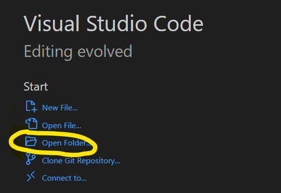
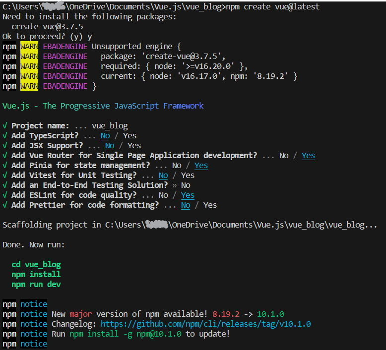
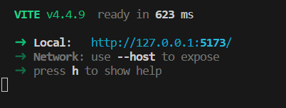
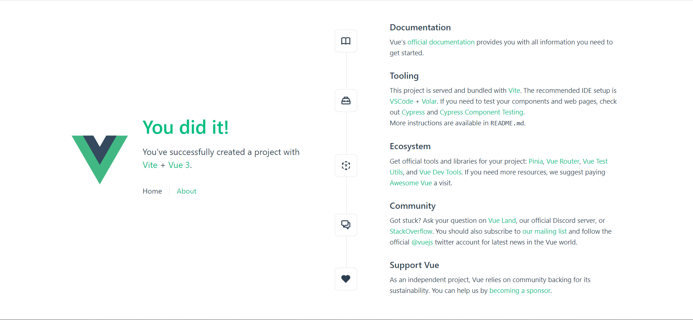

# Step by step guide to creation of this repo

- Create a new folder from VS Code
  - open VS code
  - click open folder
  
    

  - create a new folder and select
- Initialise repo and publish to Github


- Create a new Vue app with `npm create vue@latest`
  
  

- enter a name for the project - we used 'vue_blog'
- Yes to:
  - Vue Router - this allows the website to present different content based on URL
  - Pinia - we will use this to get database content and make available to Vue app
  - and ESLint - this will ensure the code is of reasonable quality

- then follow instructions in output to
  - cd vue_blog
  - npm install
  - npm run dev

You will see something like in the terminal:



and if you open your browser at the presented link:




## Adding Bootstrap CSS Framework to the project

from vue directory...

```sh
npm install bootstrap
npm install sass
```

then add this to App.vue

```html
<style lang="scss">
@import "node_modules/bootstrap/scss/bootstrap.scss";
@import url("https://cdn.jsdelivr.net/npm/bootstrap-icons@1.10.3/font/bootstrap-icons.css");
</style>
```

## Publish via AWS Amplify

- pre-requisites:
  - An AWS account
  - A Github account and repo
  - Authorise AWS Amplify to access your repos
- Add amplify.yaml
- create app in Amplify (see video in /blog_content)

We are effectively just hosting some static content here - however that content is dynamically linked to a GitHub repo, auto-updates and has an automated build step - a pretty great start to our CI/CD pipeline (another blog post there!) 

Interactivity is provided by the Vue.js framework - but any real backend capability, such as authentication and persistent data store will need to be added later.

## Add a pinia store

We want to be able to work with list of blogs, and create new blog posts - so we use a 'Pinia store' to do this.
The initial store can a couple of actions (methods):
- add_post()
- get_post_by_id()
posts are stored in the Pinia state which has a couple of properties:
- blog_posts: a simple list of blog post objects, and,
- current_blog_post: the current blog post (the one the user is viewing)